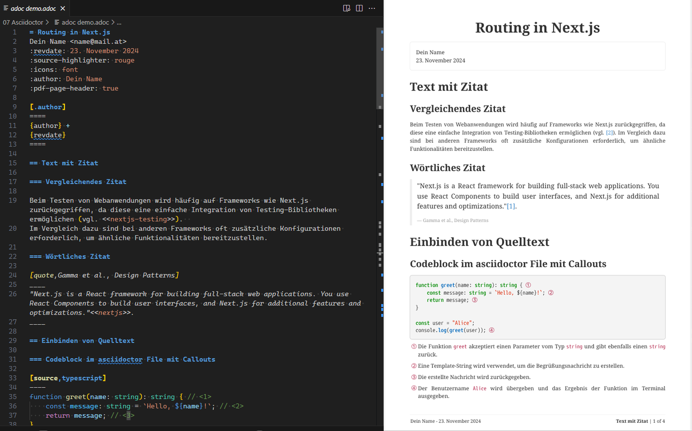

# Verwendung von Asciidoctor unter Windows und macOS



Asciidoctor ist ein System, mit dessen Hilfe technische Dokumentationen in einem Textformat geschrieben werden können.
Der Aufbau ähnelt einer Markdown Datei, Asciidoctor ist aber mächtiger.
Die Entwickler von Asciidoctor kennen scheinbar Microsoft Windows nicht, es gibt keine ausführbare Datei für Windows.
Mit Hilfe eines *Docker Images* kann allerdings auch auf Windows PCs die Installation sehr leicht durchgeführt werden.

> Für die nachfolgenden Schritte brauchst du eine lauffähige Installation von Docker.

## Installation unter Windows

1. Lade die Datei [convert_adoc.cmd](convert_adoc.cmd) herunter.
   Falls eine Warnmeldung des Browsers erscheint, musst du auf *trotzdem beibehalten* klicken.
2. Erstelle ein Verzeichnis *C:\asciidoc* und verschiebe die heruntergeladene Datei dorthin.
3. Klicke doppelt auf die Datei, sodass sie gestartet wird.

Beim ersten Start wird ein Dockerimage mit dem Namen *asciidoctor-pandoc* erstellt.
Dies kann einige Minuten dauern.
Der Vorgang muss aber nur einmal ausgeführt werden.

## Installation unter macOS

Erstelle ein Verzeichnis für das Skript (z. B. */Users/username/Scripts*) oder verwende ein bestehendes Verzeichnis.
Öffne VS Code und kopiere den Inhalt der Datei **[convert_adoc.sh](convert_adoc.sh)** hinein.
Speichere die Datei unter *convert_adoc.sh* ab.
Gehe im Terminal in dieses Verzeichnis und führe die nachfolgenden Befehle aus.
Sie geben dem Skript Ausführungsrechte und starten es einmalig, um das Docker Image zu erstellen.

```bash
chmod a+x convert_adoc.sh
./convert_adoc.sh
```

## Konvertieren von Asciidoc Dokumenten

Lade die folgenden 3 Dateien herunter.
Sie beinhalten ein Beispiel für ein Asciidoc Dokument.
Verwende in github den *Download raw file* Button.
Das *adoc* Dokument wird in github zwar gerendert angezeigt, allerdings nicht mit allen Features.

- [adoc demo.adoc](adoc%20demo.adoc)
- [adoc demo.yml](adoc%20demo.yml)
- [Example.cs](Example.cs)

Gehe dann in der Konsole in diesen Ordner (z. B. Downlaods).
Führe den folgenden Befehl aus:

**Windows**
```
C:\asciidoc\convert_adoc "adoc demo.adoc" "adoc demo.pdf"
```

**macOS**
```
/Users/username/Scripts/convert_adoc.sh "adoc demo.adoc" "adoc demo.pdf"
```

Es wird nun ein PDF erstellt.
Du kannst aber nicht nur PDF Dokumente erstellen.
Es sind auch Umwandlungen nach md (Markdown), HTML und docx (Word) möglich.
Je nach Endung nimmt das Skript die richtigen Befehle.

```
C:\asciidoc\convert_adoc "adoc demo.adoc" "adoc demo.html"
C:\asciidoc\convert_adoc "adoc demo.adoc" "adoc demo.md"
C:\asciidoc\convert_adoc "adoc demo.adoc" "adoc demo.docx"
```

Beim Markdown oder Word Format stehen allerdings nicht alle Features wie automatische Zeilennummern, Callouts, etc. zur Verfügung.
Verwende daher immer wenn mögloch die pdf oder html Ausgabe.

> Hinweis: Du kannst in den Systemeinstellungen C:\asciidoc zur *PATH* Variable hinzufügen, dann musst du das Verzeichnis nicht mehr angeben.

## Infos über die Musterdateien

Die Datei [adoc demo.adoc](adoc%20demo.adoc) ist die eigentliche Asciidoc Datei.
Sie beinhaltet den Text und die Formatierungsanweisungen.
Für die Formatierung der Kopf- und Fußzeilen kannst du eine YAML Datei anlegen.
Die Datei [adoc demo.yml](adoc%20demo.yml) beschreibt den Stil der Fußzeile.
Das Skript *convert_adoc* berücksichtigt automatisch das Layout, wenn eine yml Datei mit gleichem Namen wie die adoc Datei existiert.
Der Quelltext in [Example.cs](Example.cs) zeigt, dass in Asciidoc auch externe Dateien eingebunden werden können.

## Erstellung mit VS Code

Für VS Code gibt es die Extension [AsciiDoc](https://marketplace.visualstudio.com/items?itemName=asciidoctor.asciidoctor-vscode).
Sie bietet live preview, syntax highlighting und snippets an.

## Weiterführende Infos

- [AsciiDoc cheatsheet](https://powerman.name/doc/asciidoc)
- [AsciiDoc Syntax Quick Reference](https://docs.asciidoctor.org/asciidoc/latest/syntax-quick-reference/)
- [Compare AsciiDoc to Markdown](https://docs.asciidoctor.org/asciidoc/latest/asciidoc-vs-markdown/)
- [Bibliography (Quellenangaben)](https://docs.asciidoctor.org/asciidoc/latest/sections/bibliography/)

